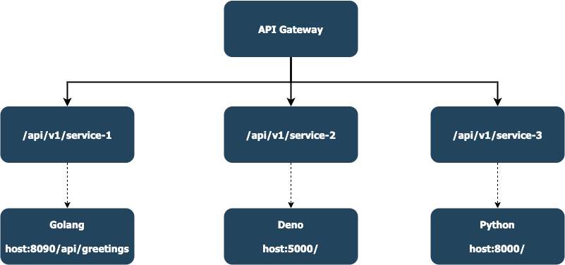

# nginx api gateway

#### Usage:
```bash
$ docker-compose up
```

#### Generate ssl certificate before deployment:
```bash
$ docker compose run --rm  certbot certonly --webroot --webroot-path /var/www/certbot/ --dry-run -d mydomain.com # check the command is success.
$ docker compose run --rm  certbot certonly --webroot --webroot-path /var/www/certbot/ -d mydomain.com           # generate actual certificate.
```

#### To deploy new nginx configuration:
```bash
$ docker compose build api-gateway
$ docker compose up --no-deps -d api-gateway
```

#### To renew certbot certificate:
```bash
$ docker compose run --rm certbot renew
```

#### API gateway high overview:


